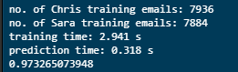

# ML_MachineLearning
Machine Learning notes and Exercises

- GaussianNB: ```from sklearn.naive_bayes import GaussianNB```

- accuracy:  ```from sklearn.metrics import accuracy_score```

# Training time (1st assignment using Naive Bayes)

- Function, when run, shows accuracy of naive bayes model and training time vs prediction time 


